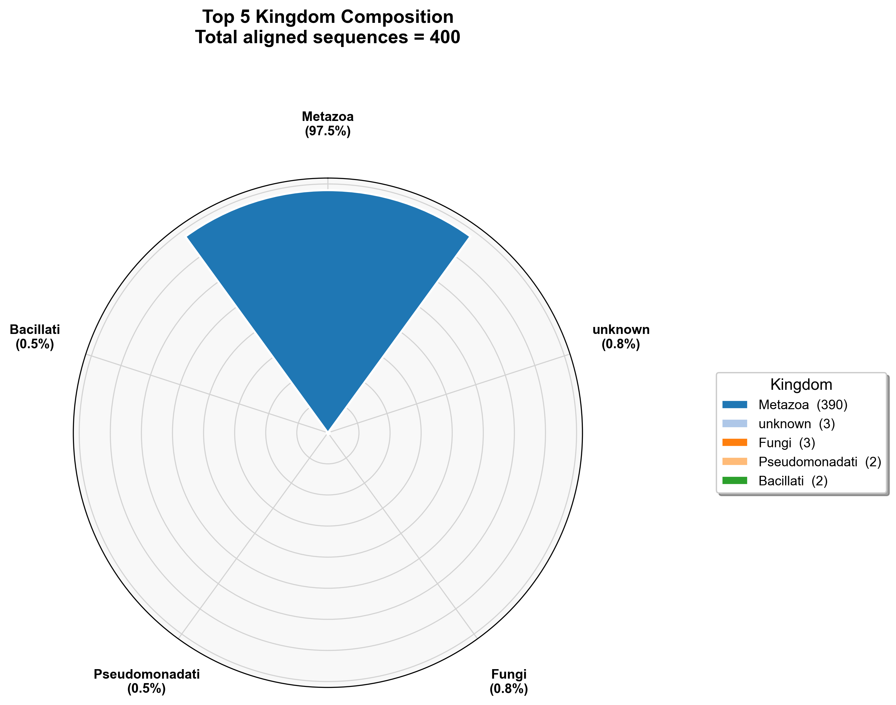
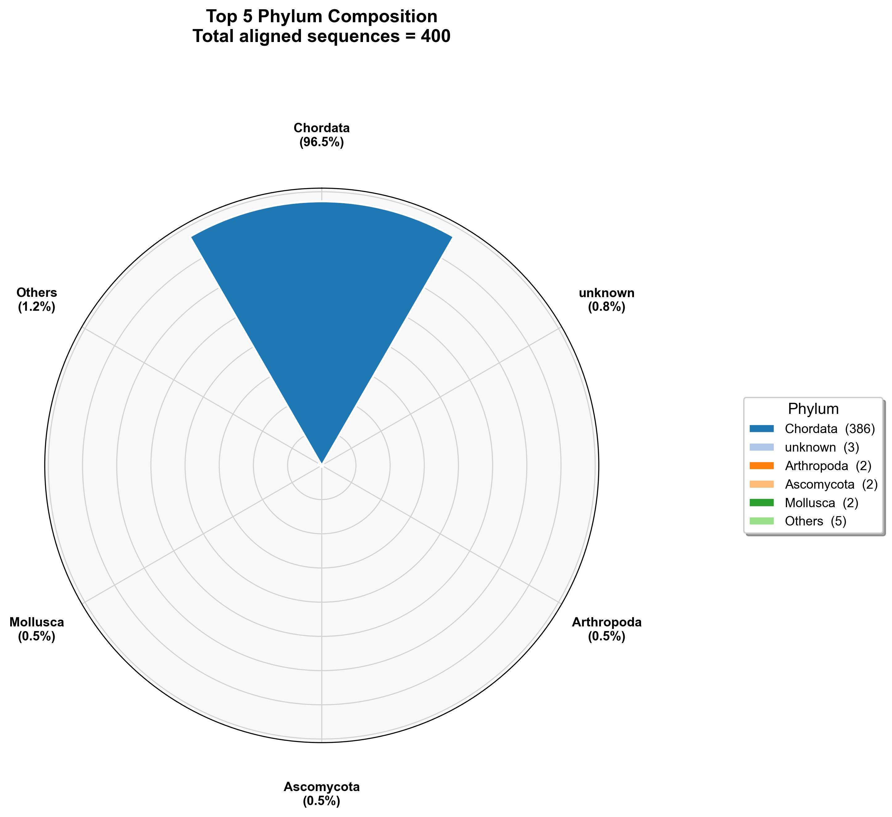
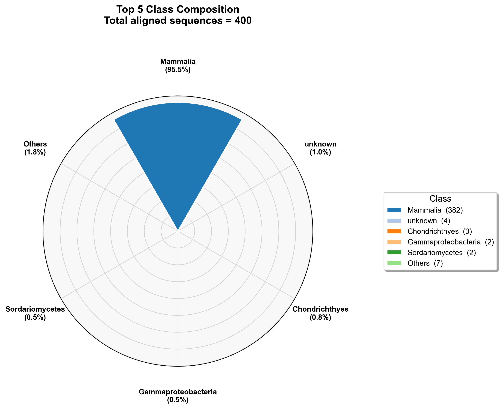
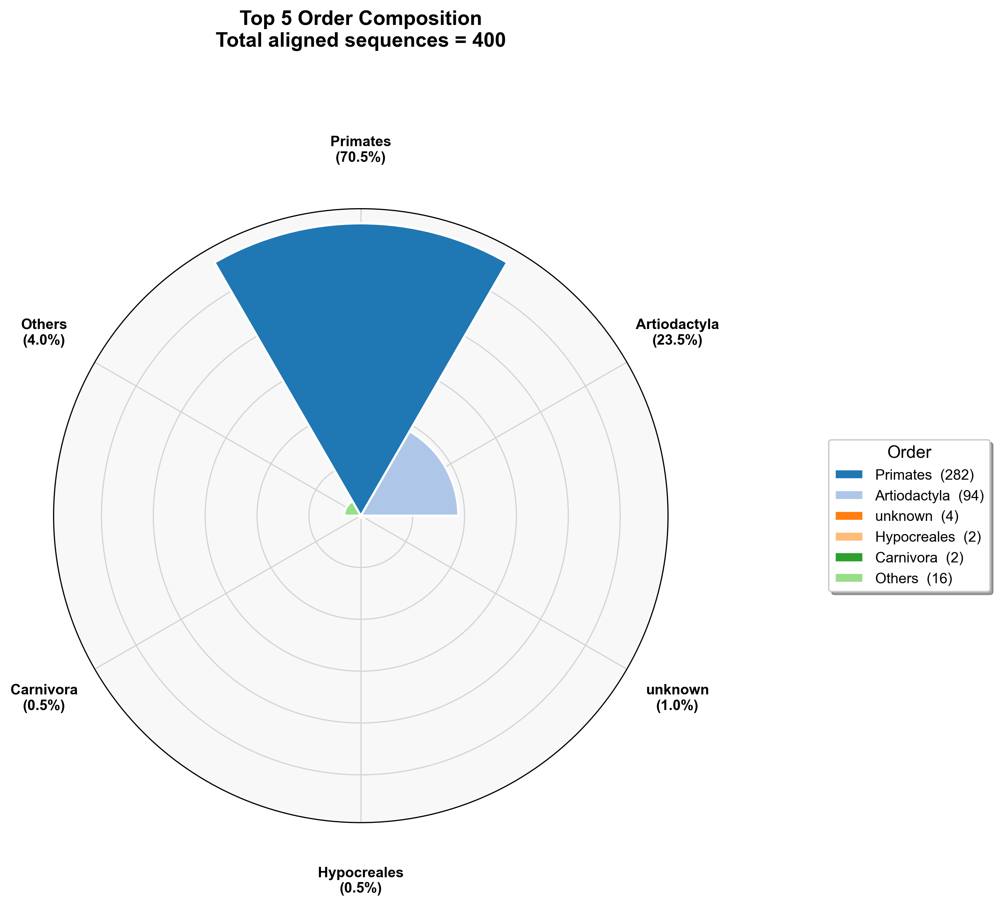
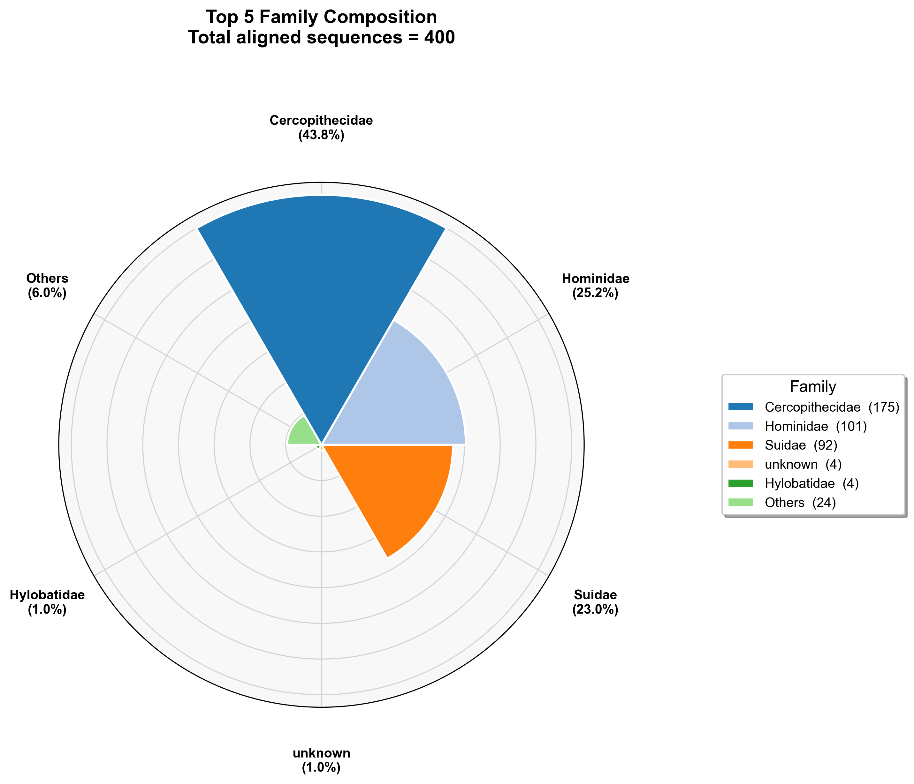
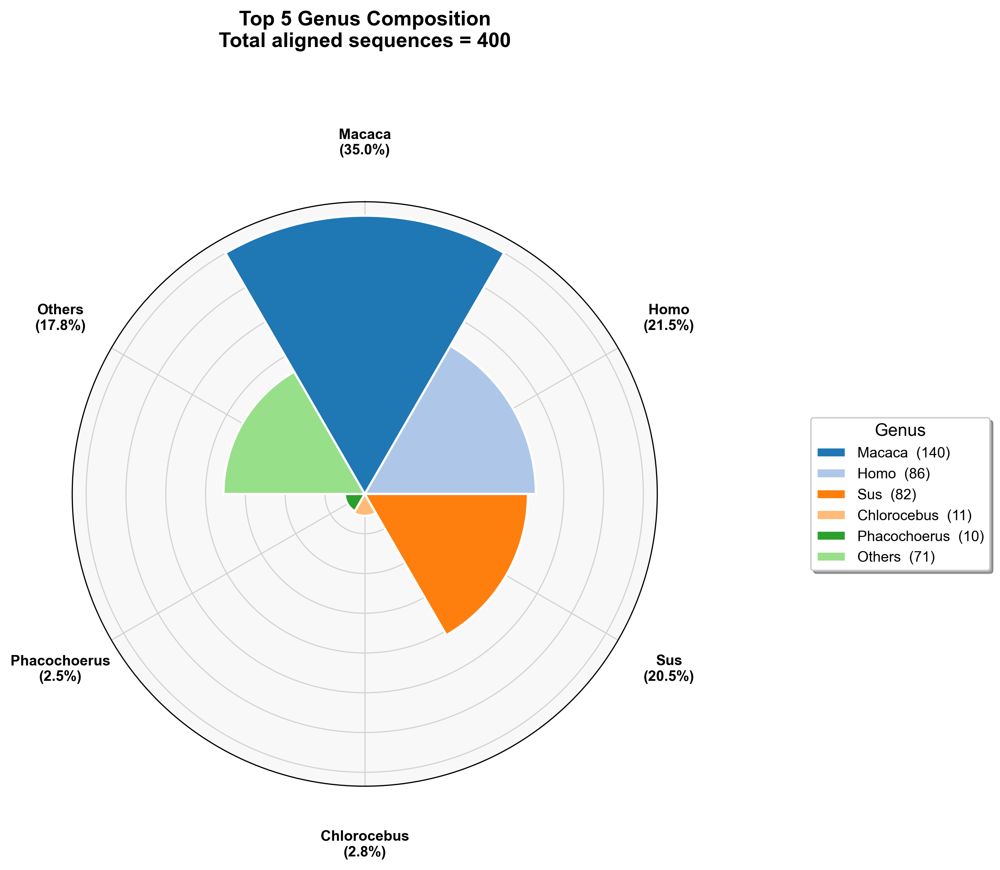
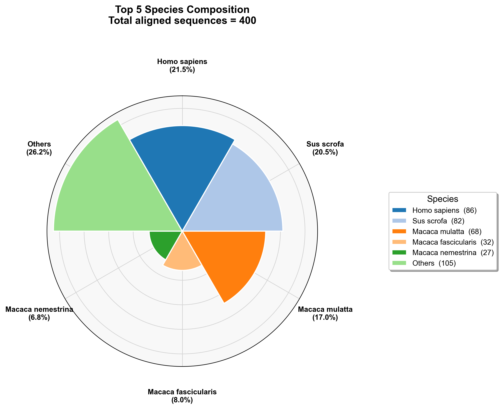

# 序列分类学分析报告

## 目录

- [1. 方法](#1-方法)
  - [1.1 分析流程](#11-分析流程)
  - [1.2 主要软件工具](#12-主要软件工具)
- [2. 结果](#2-结果)
  - [2.1 总体情况](#21-总体情况)
  - [2.2 界（Kingdom）水平](#22-界kingdom水平)
  - [2.3 门（Phylum）水平](#23-门phylum水平)
  - [2.4 纲（Class）水平](#24-纲class水平)
  - [2.5 目（Order）水平](#25-目order水平)
  - [2.6 科（Family）水平](#26-科family水平)
  - [2.7 属（Genus）水平](#27-属genus水平)
  - [2.8 种（Species）水平](#28-种species水平)
- [3. 结论](#3-结论)

## 1. 方法

### 1.1 分析流程

本分析流程包括四个主要步骤：

**1. 序列采样**

从原始FASTQ文件中随机抽取1000条序列，转换为FASTA格式，用于后续的BLAST比对分析。采样采用流式处理方式，通过管道直接完成格式转换和随机采样，大幅提升处理效率。

**2. BLAST序列比对**

使用BLASTN工具将采样序列与NCBI核酸数据库（core_nt）进行同源性比对。每个查询序列最多保留10个最佳匹配结果，设置E值阈值为1e-5，序列相似性阈值为95%，查询覆盖率阈值为85%。比对采用48线程并行计算以提高速度。

```pseudocode
INPUT: query.fa, database, output.tsv, max_target_seqs, num_threads
BEGIN
    blastn(
        -query query.fa
        -db database
        -task blastn
        -word_size 11
        -evalue 1e-5
        -perc_identity 95
        -qcov_hsp_perc 85
        -max_target_seqs max_target_seqs
        -max_hsps 1
        -dust no
        -soft_masking false
        -num_threads num_threads
        -outfmt "6 qseqid sseqid sscinames pident length
                 mismatch gapopen qstart qend sstart send
                 qcovs evalue bitscore stitle"
        -out output.tsv
    )
END
```

**3. 物种注释信息添加**

利用TaxonKit工具将BLAST结果中的物种名称转换为NCBI分类学ID（TaxID），并获取从界到种的完整分类学信息，包括界（Kingdom）、门（Phylum）、纲（Class）、目（Order）、科（Family）、属（Genus）、种（Species）七个分类层级。

对于每条比对成功的序列，BLAST可能返回多个匹配结果（本分析设置为最多10个）。在添加物种注释信息时，我们选取每条序列的最佳匹配结果（即第一个比对结果）进行注释，以确保分类学信息的准确性和一致性。最佳匹配结果通常具有最高的序列相似性和比对得分。

**4. 分类学统计与可视化**

对每个分类水平的序列丰度进行统计分析，提取Top 5丰度的分类单元，并生成风玫瑰图（极坐标条形图）进行可视化展示。

### 1.2 主要软件工具

| 软件工具 | 版本 | 用途 |
|---|---|---|
| SeqKit | 2.9.0 | 序列格式转换与随机采样 |
| BLAST+ | 2.17.0+ | 序列同源性比对 |
| TaxonKit | 0.20.0 | 分类学信息查询与转换 |
| Python | 3.12.2 | 数据统计与可视化 |

## 2. 结果

### 2.1 总体情况

本次分析从原始FASTQ文件中随机抽取了**1000**条序列进行BLAST比对分析。其中，**400**条序列能够与NCBI核酸数据库中的序列产生有效比对结果，比对成功率为**40.0%**。对这400条比对成功的序列均进行了分类学注释。

### 2.2 界（Kingdom）水平

| 界 | 序列数 | 百分比 |
|---|---:|---:|
| Metazoa（后生动物） | 390 | 97.5% |
| unknown | 3 | 0.75% |
| Fungi（真菌） | 3 | 0.75% |
| Pseudomonadati | 2 | 0.5% |
| Bacillati | 2 | 0.5% |

结果显示，在400条比对成功的序列中，有390条序列被鉴定为后生动物（Metazoa），占所有比对成功序列的97.5%，表明后生动物在样本中占绝对优势。



### 2.3 门（Phylum）水平

| 门 | 序列数 | 百分比 |
|---|---:|---:|
| Chordata（脊索动物） | 386 | 96.5% |
| unknown | 3 | 0.75% |
| Arthropoda（节肢动物） | 2 | 0.5% |
| Ascomycota（子囊菌） | 2 | 0.5% |
| Mollusca（软体动物） | 2 | 0.5% |
| Others | 5 | 1.25% |

在400条比对成功的序列中，有386条序列被鉴定为脊索动物门（Chordata），占所有比对成功序列的96.5%，显示脊索动物门在样本中占据主导地位。



### 2.4 纲（Class）水平

| 纲 | 序列数 | 百分比 |
|---|---:|---:|
| Mammalia（哺乳纲） | 382 | 95.5% |
| unknown | 4 | 1.0% |
| Chondrichthyes（软骨鱼纲） | 3 | 0.75% |
| Gammaproteobacteria | 2 | 0.5% |
| Sordariomycetes | 2 | 0.5% |
| Others | 7 | 1.75% |

在400条比对成功的序列中，有382条序列被鉴定为哺乳纲（Mammalia），占所有比对成功序列的95.5%，显示哺乳纲是样本中最主要的类群。



### 2.5 目（Order）水平

| 目 | 序列数 | 百分比 |
|---|---:|---:|
| Primates（灵长目） | 282 | 70.5% |
| Artiodactyla（偶蹄目） | 94 | 23.5% |
| unknown | 4 | 1.0% |
| Hypocreales | 2 | 0.5% |
| Carnivora（食肉目） | 2 | 0.5% |
| Others | 16 | 4.0% |

在400条比对成功的序列中，灵长目（Primates）和偶蹄目（Artiodactyla）是两个主要类群。其中，282条序列被鉴定为灵长目，占所有比对成功序列的70.5%；94条序列被鉴定为偶蹄目，占23.5%。



### 2.6 科（Family）水平

| 科 | 序列数 | 百分比 |
|---|---:|---:|
| Cercopithecidae（猴科） | 175 | 43.75% |
| Hominidae（人科） | 101 | 25.25% |
| Suidae（猪科） | 92 | 23.0% |
| unknown | 4 | 1.0% |
| Hylobatidae（长臂猿科） | 4 | 1.0% |
| Others | 24 | 6.0% |

在400条比对成功的序列中，猴科（Cercopithecidae）、人科（Hominidae）和猪科（Suidae）是三个主要科。其中，175条序列被鉴定为猴科，占所有比对成功序列的43.75%；101条序列被鉴定为人科，占25.25%；92条序列被鉴定为猪科，占23.0%。



### 2.7 属（Genus）水平

| 属 | 序列数 | 百分比 |
|---|---:|---:|
| Macaca（猕猴属） | 140 | 35.0% |
| Homo（人属） | 86 | 21.5% |
| Sus（猪属） | 82 | 20.5% |
| Chlorocebus（绿猴属） | 11 | 2.75% |
| Phacochoerus（疣猪属） | 10 | 2.5% |
| Others | 71 | 17.75% |

在400条比对成功的序列中，猕猴属（Macaca）、人属（Homo）和猪属（Sus）是三个主要属。其中，140条序列被鉴定为猕猴属，占所有比对成功序列的35.0%；86条序列被鉴定为人属，占21.5%；82条序列被鉴定为猪属，占20.5%。



### 2.8 种（Species）水平

| 种 | 序列数 | 百分比 |
|---|---:|---:|
| Homo sapiens（智人） | 86 | 21.5% |
| Sus scrofa（野猪/家猪） | 82 | 20.5% |
| Macaca mulatta（恒河猴） | 68 | 17.0% |
| Macaca fascicularis（食蟹猴） | 32 | 8.0% |
| Macaca nemestrina（豚尾猴） | 27 | 6.75% |
| Others | 105 | 26.25% |

在400条比对成功的序列中，智人（Homo sapiens）、野猪/家猪（Sus scrofa）和恒河猴（Macaca mulatta）是三个主要物种。其中，86条序列被鉴定为智人，占所有比对成功序列的21.5%；82条序列被鉴定为野猪/家猪，占20.5%；68条序列被鉴定为恒河猴，占17.0%。



## 3. 结论

1. **物种组成高度集中**：在比对成功的400条序列中，绝大多数（97.5%）属于后生动物界，其中哺乳纲占95.5%，显示样本以哺乳动物为主。

2. **灵长类占绝对优势**：在比对成功的序列中，灵长目序列占70.5%，包括猴科（43.75%）、人科（25.25%）和长臂猿科（1.0%），表明样本主要来源于灵长类动物。

3. **主要物种明确**：在比对成功的序列中，猕猴属（Macaca, 35.0%）是最主要的属，包括恒河猴（Macaca mulatta, 17.0%）、食蟹猴（Macaca fascicularis, 8.0%）和豚尾猴（Macaca nemestrina, 6.75%）。智人（Homo sapiens, 21.5%）和野猪/家猪（Sus scrofa, 20.5%）也是主要物种。

4. **偶蹄类占比显著**：偶蹄目序列占23.5%，主要由猪科（Suidae, 23.0%）贡献，包括猪属（Sus, 20.5%）和疣猪属（Phacochoerus, 2.5%）。

5. **物种多样性**：除了主要物种外，还有约26.25%的比对成功序列分布在其他物种中，显示样本具有一定的物种多样性。

6. **分类学注释完整性**：仅有少量比对成功的序列（1.0%）无法确定分类学信息，整体注释效果良好。